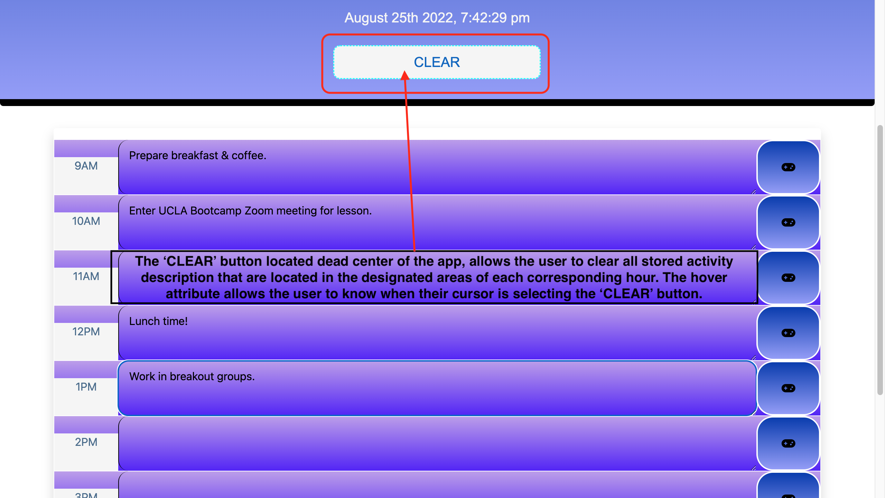

# PLAN MY DAY 

## APPLICATION OVERVIEW:

The Plan My Day work planner is a user friendly and intuitive application designed to assist the user in planning out their daily work activities. Some of the functionality includes the user's ability to transcribe their work acitvities in as much detail as desired within the expandable text area rows, each corresponding to an hour of the work day.

Additionally, the application has a date & time text bar located directly in the center of the header, which displays a live full date and time stamp down to seconds. Furthermore, the app contains a 'CLEAR' button designed to erase all of the activity descriptions the user may have entered throughout the usage of the planner. Lastly, the save button is designed to save the work activity description for each corresponding hour indicated by the 'game controller' icon and hover attributes.

This app will run in the browser featuring dynamically updated HTML and CSS powered by jQuery. It is designed to work off JavaScript linked to a library located in [Moment.js](https://momentjs.com/), specifically to work with live dates and times.

Below is an 'Acceptance Criteria' used to rate the app prior to making it available to the public:

## ACCEPTANCE CRITERIA:

```md
GIVEN I am using a daily planner to create a schedule
WHEN I open the planner
THEN the current day is displayed at the top of the calendar
WHEN I scroll down
THEN I am presented with timeblocks for standard business hours
WHEN I view the timeblocks for that day
THEN each timeblock is color coded to indicate whether it is in the past, present, or future
WHEN I click into a timeblock
THEN I can enter an event
WHEN I click the save button for that timeblock
THEN the text for that event is saved in local storage
WHEN I refresh the page
THEN the saved events persist
```

**Note:** The following GIF and images will demonstrate the application's look and functionality:


### Main Screen:


### Data Storage & Corresponding Time:


### Save Button:




### 'CLEAR' Button:


### Deployed Webpage URL:

https://aasports89.github.io/plan-my-day/

### GitHUB Repository URL:

https://github.com/AASports89/plan-my-day

## EVALUATION GUIDELINE:

This application is evaluated based on the following guideline:

### Technical Acceptance Criteria: 40%

* Satisfies all of the above acceptance criteria plus the following:

  * Uses a date utility library to work with date and time

### Deployment: 32%

* Application deployed at live URL

* Application loads with no errors

* Application GitHub URL submitted

* GitHub repo contains application code

### Application Quality: 15%

* Application user experience is intuitive and easy to navigate

* Application user interface style is clean and polished

* Application resembles the mock-up functionality provided in the Challenge instructions

### Repository Quality: 13%

* Repository has a unique name

* Repository follows best practices for file structure and naming conventions

* Repository follows best practices for class/id naming conventions, indentation, quality comments, etc.

* Repository contains multiple descriptive commit messages

* Repository contains quality README file with description, screenshot, and link to deployed application

## Review

You are required to submit the following for review:

* The URL of the deployed application

* The URL of the GitHub repository, with a unique name and a README describing the project

- - -